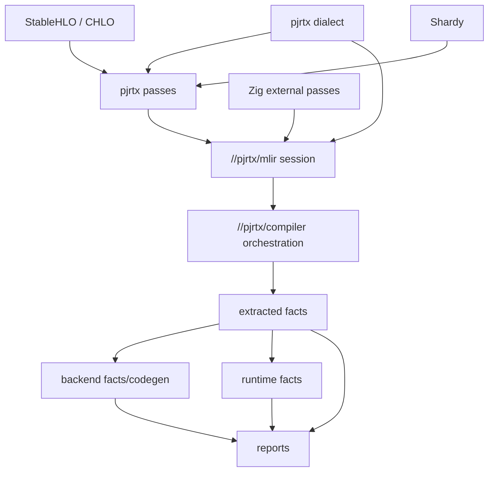

# Final MLIR Dialect, Op, And Pass Architecture V0

This spec defines the destination architecture after the current MLIR
attribute/state bridge. It does not ask for a giant rewrite. It gives the code
refactor a north star:

```text
PjRTx compiler facts become real MLIR dialect ops, attrs, types, and passes.
Zig orchestrates policy and extraction.
Minimal MLIR-native C++/TableGen exposes MLIR's extension points.
```

The current string/dictionary attributes are temporary. They are acceptable only
while each fact is committed, verified, extracted, and tested. The final shape
should make those facts native MLIR objects with verifier hooks and pass
pipeline integration.

## Source Layout

Bootstrap the final layout as files with intent comments before filling in all
implementation:

```text
//pjrtx/dialects
  BUILD.bazel
  PjrtxBase.td
  PjrtxAttrs.td
  PjrtxTypes.td
  PjrtxOps.td
  PjrtxPasses.td
  pjrtx_dialect.h
  pjrtx_dialect.cc
  pjrtx_passes.h
  pjrtx_passes.cc
  pjrtx_c_api.h
  pjrtx_c_api.cc

//pjrtx/mlir
  BUILD.bazel
  session.zig
  c_api.zig
  runfiles.zig
  README.md

//pjrtx/compiler/passes
  BUILD.bazel
  state_probe.zig
  target_legal.zig
  fusion_discovery.zig
  fusion_plan.zig
  lowering_plan.zig
  codegen_plan.zig
  schedule_plan.zig
  README.md
```

The intent of each file:

- `PjrtxBase.td`: dialect name, assembly namespace, common traits.
- `PjrtxAttrs.td`: target, dtype-rate, fusion, tile, memory, collective, cost,
  traffic, codegen, schedule, backend, runtime, and profile attributes.
- `PjrtxTypes.td`: small value types for IDs, memory spaces, execution units,
  streams, events, and buffer placements when native MLIR types help verifiers.
- `PjrtxOps.td`: stateful compiler facts and executable-plan ops.
- `PjrtxPasses.td`: pass declarations and generated registration hooks.
- `pjrtx_c_api.*`: narrow C-compatible functions consumed by Zig.
- `session.zig`: Zig ownership of MLIR context, registry, module, pass manager,
  diagnostics, and deterministic dumps.
- `compiler/passes/*.zig`: Zig policy passes implemented as MLIR external pass
  callbacks when the MLIR C API is sufficient.

## Dialect Dependency Graph



MLIR dialect dependencies must stay below Zig policy. The C++ dialect layer
does not call into Zig and does not own PjRTx target policy. Zig calls into the
dialect/pass C ABI and receives verified MLIR state back.

## Operation Families

The final dialect should be split by fact family. Names below are conceptual;
the exact spelling can change during TableGen implementation.

### Module And Target

```mlir
pjrtx.module_state
pjrtx.target_spec
pjrtx.target_memory_space
pjrtx.target_transfer_edge
pjrtx.target_execution_unit
pjrtx.target_dtype_rate
```

Outputs:

- target fingerprint material
- memory hierarchy
- transfer topology
- dtype/op-class rates
- execution-unit capabilities

Verifier intent:

- target IDs are unique
- transfer edges reference existing memory spaces
- dtype rates reference existing execution units
- unknown performance rates are explicit, not omitted

### Source And Graph View

```mlir
pjrtx.source
pjrtx.graph_value
pjrtx.graph_instruction
pjrtx.graph_return
```

Outputs:

- stable source IDs
- graph value IDs and tensor descriptors
- graph instruction IDs linked to StableHLO ops

Verifier intent:

- every executable fact points back to source or graph IDs
- unsupported or dynamic V0 shapes fail before target legality
- Shardy metadata and tokens are preserved or explicitly rejected

### Fusion, Tiling, And Memory

```mlir
pjrtx.fusion_candidate
pjrtx.fusion_decision
pjrtx.tile_plan
pjrtx.layout_plan
pjrtx.memory_space_assignment
pjrtx.pressure_delta
```

Outputs:

- accepted and rejected fusion candidates
- logical tile shapes
- layout and memory-space decisions
- pressure deltas and capacity requirements

Verifier intent:

- fusion does not cross unsafe collective/token/side-effect boundaries
- tile memory fits the selected memory space before backend binding
- rejected alternatives include a reason

### Collectives

```mlir
pjrtx.collective_spec
pjrtx.collective_group
pjrtx.collective_channel
pjrtx.collective_algorithm
pjrtx.collective_lowering
pjrtx.collective_traffic
```

Outputs:

- collective participants
- channel/rendezvous facts
- selected or rejected algorithms
- collective-engine requirements
- interconnect traffic estimates

Verifier intent:

- participants are inside `replicas * partitions`
- duplicate participants fail
- tokenized collectives either lower explicitly or fail
- unsupported algorithms fail during compile, never runtime

### Performance And Lowering

```mlir
pjrtx.performance_cost
pjrtx.memory_traffic
pjrtx.lowering_region
pjrtx.lowering_region_fact
pjrtx.roofline_estimate
```

Outputs:

- logical ops by dtype/op class
- bytes read/written
- expected execution unit
- lowering region membership
- roofline estimates from target rates

Verifier intent:

- every backend-execute command has lowering provenance
- performance rows reference existing lowering regions and target units
- cost and traffic facts can be joined back to source operations

### Codegen And Backend Binding

```mlir
pjrtx.codegen_region
pjrtx.codegen_kernel
pjrtx.codegen_library_call
pjrtx.backend_binding
pjrtx.backend_executable_call
pjrtx.backend_kernel_graph
```

Outputs:

- generated-kernel candidates
- selected library calls
- backend operation names
- backend executable calls
- kernel graph nodes and edges

Verifier intent:

- library calls are intentional lowerings, not fallback
- generated kernels have math policy, dtype, tile, scratch, and profile keys
- backend bindings reference verified schedule commands

### Schedule, Runtime, And Profile

```mlir
pjrtx.schedule_command
pjrtx.schedule_overlap
pjrtx.buffer_allocation
pjrtx.buffer_lifetime
pjrtx.stream_step
pjrtx.profile_event
pjrtx.profile_join
```

Outputs:

- command order
- overlap candidates and selected dependencies
- allocation reservations
- stream/event topology
- observed or synthetic profile events
- profile joins back to compiler/backend/runtime facts

Verifier intent:

- dependencies point to earlier commands unless explicitly async-safe
- allocation lifetimes match command use
- profile events join to known commands, lowerings, or backend calls

## Pass Families

Each pass has a stable name, required input state, produced output state,
verified invariants, emitted facts, invalidated analyses, and diagnostics.

```text
stablehlo_parse
stablehlo_verify
shardy_metadata_import
pjrtx_target_attach
pjrtx_target_legal
pjrtx_canonicalize
pjrtx_fusion_discover
pjrtx_fusion_decide
pjrtx_tile_select
pjrtx_memory_plan
pjrtx_collective_verify
pjrtx_collective_lower
pjrtx_cost_model
pjrtx_lowering_region_form
pjrtx_memory_traffic_model
pjrtx_codegen_region_form
pjrtx_tile_legal
pjrtx_schedule_plan
pjrtx_backend_bind
pjrtx_executable_contract
pjrtx_bufferize
pjrtx_runtime_plan
pjrtx_profile_join
```

Zig external passes should be preferred for:

- target legality policy
- V0 fusion decision policy
- V0 tile selection
- V0 collective algorithm selection
- V0 cost/traffic derivation
- schedule and overlap planning
- extraction-oriented verification

MLIR-native C++/TableGen pass glue should be used for:

- dialect registration
- canonicalization patterns
- dialect conversion
- parser/printer/verifier integration
- op rewrites that require MLIR C++ APIs not exposed through the C API

## State Machine

The final state machine should be explicit and monotonic:

```text
imported
target_attached
target_legal
canonicalized
fusion_planned
tile_planned
memory_planned
collectives_planned
collectives_lowered
lowering_planned
performance_modeled
codegen_planned
tile_legal
scheduled
backend_bound
executable_ready
bufferized
runtime_planned
profile_joined
```

No pass may silently skip a state. A pass that cannot establish its output state
must fail with diagnostics through `std.Io.Writer`.

## Extraction Outputs

Extraction remains necessary because backend/runtime/report layers should not
hold raw MLIR handles forever. Extracted views are compact API surfaces, not the
compiler truth.

Extraction families:

- target description view
- graph/source view
- fusion/tiling/memory/collective views
- lowering, cost, traffic, codegen, schedule views
- backend executable and kernel graph views
- runtime allocation, stream, and profile views
- report-ready profile joins

The extraction rule:

```text
If a report or runtime handoff consumes a fact, that fact must first exist in
MLIR, pass verification, and be extracted through the owning package.
```

## Bootstrap Acceptance

The first implementation slice for this spec is accepted when:

- `//pjrtx/dialects` exists with TableGen/C++ skeleton files and Bazel targets
- `//pjrtx/mlir` owns `MlirSession` instead of `//pjrtx/compiler`
- one current attribute fact is replaced by a real dialect attr or op
- one Zig external pass is moved under `//pjrtx/compiler/passes`
- tests prove dialect registration, pass execution, MLIR verification, and
  deterministic extraction
- `bazel test //pjrtx/...` passes

Do not start by replacing every attribute. Start by creating the real boundary,
then migrate one fact family at a time.
