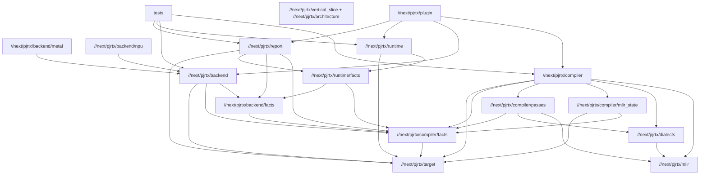

# Package Boundaries V0

This spec defines the package graph for the next PjRTx architecture pass. The
central correction is:

```text
No //next/pjrtx/core package.
No central vocabulary bucket.
Every type lives with the layer that owns its invariants.
```

`//next/pjrtx/core` was useful as a bootstrap forcing function, but it now creates
the wrong gravity. Compiler, backend, runtime, plugin, tests, and reports all
importing one package makes ownership look explicit in docs while the code has
a hidden center.

The next refactor should remove that center and replace it with narrow package
contracts.

## Dependency Graph

The intended package graph is acyclic and biased toward ownership:



Forbidden edges:

- `//next/pjrtx/compiler` must not depend on `//next/pjrtx/backend` or `//next/pjrtx/runtime`.
- `//next/pjrtx/backend` must not depend on `//next/pjrtx/runtime`.
- `//next/pjrtx/runtime` must not depend on `//next/pjrtx/compiler` directly.
- `//next/pjrtx/target` must not depend on compiler, backend, runtime, report, or
  plugin packages.
- No package may depend on a resurrected `//next/pjrtx/core`.

## Ownership Table

| Package | Owns | Does Not Own | Primary Outputs |
| --- | --- | --- | --- |
| `//next/pjrtx/target` | Hardware topology, memory spaces, transfer edges, execution units, dtype rates, fingerprints | Graph IR, lowering policy, backend calls, runtime buffers | `TargetDescription`, validation, target summaries |
| `//next/pjrtx/mlir` | MLIR context/session/pass manager wrapper, C API bindings, deterministic dumps | PjRTx dialect definitions, compiler policy | `MlirSession`, pass-manager helpers, C imports |
| `//next/pjrtx/dialects` | TableGen/C++ PjRTx dialect ops, attrs, types, verifier hooks, C-compatible registration | Zig policy, target models, runtime execution | dialect libs, generated headers, narrow C ABI |
| `//next/pjrtx/compiler/facts` | Extracted compiler views: source refs, graph values/instructions, fusion, placement, collectives, lowering, cost, traffic, codegen, schedule, backend binding intent, executable readiness, explain | Backend executable calls, runtime buffers, report formatting | deterministic structs, deinit, validators |
| `//next/pjrtx/compiler/mlir_state` | MLIR state-machine implementation, bounded attribute bridge, external pass callbacks, extracted MLIR state facts | StableHLO import policy, backend execution, runtime allocation calls | verified state transitions, MLIR fact commit/verify/extract APIs |
| `//next/pjrtx/compiler/passes` | Zig-owned external MLIR passes and pass-local policy | Package-wide orchestration, runtime execution | pass callbacks, pass contracts, verifier transitions |
| `//next/pjrtx/compiler` | Input ingest, pass orchestration, target legality, extraction, compile pipeline | Backend submission, device allocation | compiled executable view, compiler diagnostics |
| `//next/pjrtx/backend/facts` | Backend executable calls, kernel graph facts, backend codegen descriptors, backend profile joins | Target model, schedule construction, compiler backend-binding intent, runtime streams | backend-owned extracted views |
| `//next/pjrtx/backend/metal` | Metal/MLS graph and kernel-generation contracts | Generic compiler lowering, runtime allocator policy | Metal/MLS executable descriptors |
| `//next/pjrtx/backend/npu` | TRN2-like NPU backend constraints and generated-kernel contracts | Generic target model, compiler graph import | NPU codegen/profile descriptors |
| `//next/pjrtx/backend` | Backend capability contracts and backend-independent binding checks | Compiler pass decisions, runtime stream execution | backend plans and verification |
| `//next/pjrtx/runtime/facts` | Allocations, buffer uses, lifetimes, stream steps, events, profile observations | Compiler legality, backend codegen | runtime extracted views |
| `//next/pjrtx/runtime` | Device allocator boundary, command execution, streams/events, profiling | Compiler lowering decisions | runtime plans, execution/profile results |
| `//next/pjrtx/report` | Stable summaries and golden normalization from extracted facts | Owning or mutating facts | deterministic text output |
| `//next/pjrtx/plugin` | PJRT adapter and public error mapping | Compiler internals, backend internals | PJRT-visible compile/execute handles |

## Package Intent Files

Each new package should start with a short README or package doc that states:

- what this package owns
- what this package must not own
- which packages it may import
- which public outputs it produces
- which invariants it verifies locally
- how it uses `std.Io.Reader` and `std.Io.Writer`
- what future MLIR dialect facts should replace temporary Zig views

These intent docs are not schema duplicates. They are boundary contracts.
Schema details stay in the owning spec files under `next/docs/specs`.

Implementation inside a package should follow the same boundary discipline.
Split code across meaningfully named files such as `ids.zig`, `graph.zig`,
`passes.zig`, `lowering.zig`, `allocation.zig`, or backend-specific contract
files. Package root files may re-export and compose these families, but should
not own unrelated behavior. Domain logic belongs in small structs named after
the invariant they protect, not in loose utility functions.

## Output Contracts

Packages should compose through explicit output contracts, not through a shared
utility bucket.

Compiler outputs:

- imported graph view
- target legality result
- pass pipeline report
- extracted fusion, placement, collective, lowering, cost, memory traffic,
  codegen, schedule, and explain facts
- executable readiness contract

Backend outputs:

- backend binding verification
- backend executable plan
- backend kernel graph facts
- generated-kernel or library-call descriptors
- backend profile joins

Runtime outputs:

- allocation plan facts
- stream/event plan facts
- profile event facts
- execution result status

Report outputs:

- stable text summaries
- normalized golden text
- optional future structured report encoding

The report package may read all extracted facts. It may not become the owner of
those facts.

## Migration From `//next/pjrtx/core`

The migration should be mechanical and boundary-preserving:

1. Move target model records and validators to `//next/pjrtx/target`. This first
   slice is live: the target package owns the concrete records, validation, and
   summary writer, while `//next/pjrtx/core` temporarily re-exports aliases for
   report-shaped callers that have not moved yet.
2. Move graph, source, tensor, pass, fusion, placement, collective, lowering,
   cost, memory traffic, schedule, codegen, backend-binding intent, and explain
   views to `//next/pjrtx/compiler/facts`. The first source/graph/tensor slice is
   live: `//next/pjrtx/compiler/facts` owns the concrete definitions and validation,
   compiler/backend/runtime implementation code imports them directly as
   immutable graph input facts, and `//next/pjrtx/core` temporarily re-exports them
   only because `TraceReport` has not moved to `//next/pjrtx/report` yet. The
   compiler-middle slice is also live: pass, rewrite, fusion, placement,
   collective, lowering, cost, and memory-traffic records are compiler facts,
   with `//next/pjrtx/core` acting only as a temporary compatibility bridge.
3. Move backend executable, kernel graph, backend codegen descriptor, and
   backend profile join views to `//next/pjrtx/backend/facts`.
4. Move runtime allocation, stream, profile event, and runtime profile join
   views to `//next/pjrtx/runtime/facts`.
5. Move deterministic summary writers and report normalization to
   `//next/pjrtx/report`.
6. Replace imports package by package, keeping tests green after each move.
7. Delete `//next/pjrtx/core` only after `rg "//next/pjrtx/core|pjrtx/core"` is empty.

During migration, compatibility aliases should be avoided in new packages. The
deprecated `//next/pjrtx/core` package may keep a tiny bridge only for legacy records
that still embed moved types. New callers should import the owning package
directly, and every follow-up slice should shrink the bridge rather than grow
it.

## Boundary Tests

`//next/pjrtx/architecture:boundary_test` is the first live guardrail for this
spec. It is intentionally baseline-aware during migration: the current
bootstrap `//next/pjrtx/core` references are counted exactly, and any new reference
fails the test. When a package is migrated out of `core`, lower the expected
count in the test in the same change.

The test currently enforces:

- `//next/pjrtx/compiler` does not import backend/runtime packages
- `//next/pjrtx/backend` does not import runtime/plugin packages
- `//next/pjrtx/runtime` does not import backend/plugin packages
- `//next/pjrtx/plugin` does not import backend implementation packages
- deprecated `//next/pjrtx/core` does not import migrated packages
- no new `//next/pjrtx/core` import is introduced beyond the pinned bootstrap
  baseline
- `//next/pjrtx/core:sources` is not reintroduced

As new packages become live, extend the test before adding production edges:

- `//next/pjrtx/target` has no upward imports
- `//next/pjrtx/mlir` stays policy-free
- `//next/pjrtx/dialects` stays dialect/registration-focused
- `//next/pjrtx/compiler/facts` stays free of backend/runtime orchestration
- `//next/pjrtx/report` performs no planning or mutation

Bazel visibility should eventually enforce the same graph, but the shell test
keeps the migration honest while package splits are still moving.

## Acceptance

This spec is accepted when:

- docs and Bazel targets describe the package graph above
- `//next/pjrtx/core` is removed from all live imports
- each replacement package has an intent doc
- `bazel test //next/pjrtx/...` passes
- a boundary test fails if a forbidden dependency is introduced
